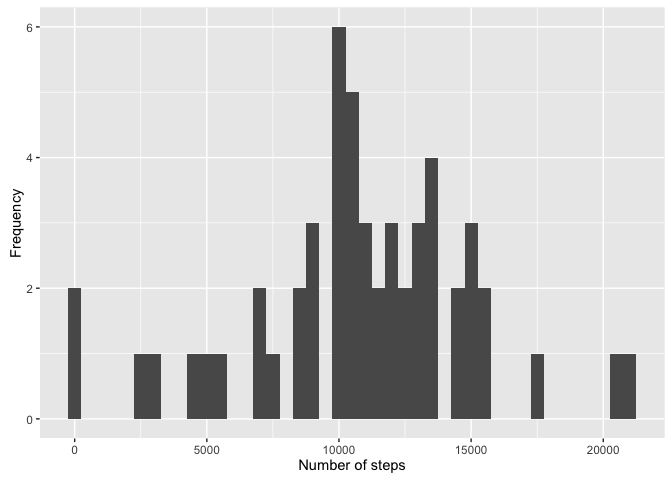

# Reproducible Research: Peer Assessment 1


## Loading and preprocessing the data
In the following chunck of code we load the data and preprocess it to have it in the correct format. This presupposes that R is already in the directory where the data is located.


```r
library(plyr)
library(ggplot2)
mydata = read.csv("activity.csv", header = TRUE)
mydata$date = as.Date(mydata$date, format= "%Y-%m-%d")
```


## What is mean total number of steps taken per day?
The total number of steps taken per day will be obtained in the following data frame where we split our original data by date and add the number of steps for each given day. With this information, we can now make a histogram of the total number of steps per day. Finally, we compute the mean and median of the number of steps per day.

```r
totalSteps = ddply(mydata, .(date), summarize, tot = sum(steps))
qplot(totalSteps$tot, geom = "histogram", binwidth=500, ylab="Frequency", xlab="Number of steps")
```

```
## Warning: Removed 8 rows containing non-finite values (stat_bin).
```

<!-- -->

```r
mymean = mean(totalSteps$tot, na.rm = TRUE)
mymedian = median(totalSteps$tot, na.rm = TRUE)
print(mymean)
```

```
## [1] 10766.19
```

```r
print(mymedian)
```

```
## [1] 10765
```


## What is the average daily activity pattern?
1. Make a time series plot (i.e. type = "l") of the 5-minute interval (x-axis)
and the average number of steps taken, averaged across all days (y-axis)
For this part of the assignment, I first created a new data frame with he average number of steps taken in each 5-min interval. I then used that data frame to make the plot.

```r
avgSteps = ddply(mydata, .(interval), summarize, aveSteps = mean(steps, na.rm = TRUE))
plot(avgSteps$interval, avgSteps$aveSteps, type = 'l', xlab="Interval", ylab = "Average number of steps")
```

<!-- -->

2. Which 5-minute interval, on average across all the days in the dataset,
contains the maximum number of steps?
We compute the maximum of the column 

```r
mymax = max(avgSteps$aveSteps, na.rm = TRUE)
print(mymax)
```

```
## [1] 206.1698
```
## Imputing missing values
1. Calculate and report the total number of missing values in the dataset
(i.e. the total number of rows with NAs)
We use the function complete.cases to do this. Complete.cases() returns a logical vector indicating if there is no NA in that row (TRUE) or FALSE otherwise. The length function tells us how many rows have NAs.


```r
length(which(complete.cases(mydata) == FALSE))
```

```
## [1] 2304
```

2. Devise a strategy for filling in all of the missing values in the dataset. The
strategy does not need to be sophisticated. For example, you could use
the mean/median for that day, or the mean for that 5-minute interval, etc.

Upon further inspection, the only column with missing values is the one for the number of steps per day

```r
library(dplyr)
```

```
## 
## Attaching package: 'dplyr'
```

```
## The following objects are masked from 'package:plyr':
## 
##     arrange, count, desc, failwith, id, mutate, rename, summarise,
##     summarize
```

```
## The following objects are masked from 'package:stats':
## 
##     filter, lag
```

```
## The following objects are masked from 'package:base':
## 
##     intersect, setdiff, setequal, union
```

```r
library(magrittr)
length(which(complete.cases(mydata$steps) == FALSE))
```

```
## [1] 2304
```

```r
length(which(complete.cases(mydata$interval) == FALSE))
```

```
## [1] 0
```

```r
length(which(complete.cases(mydata$date) == FALSE))
```

```
## [1] 0
```
To input the missing values, we will use the mean number of steps for each interval and replace the NA by that value. First, we will add a column to the old data set to compute the mean number of steps in each interval. 

```r
mydata = mydata%>% group_by(interval) %>% mutate(mean_steps = mean(steps, na.rm = T))
```

3. Create a new dataset that is equal to the original dataset but with the missing data filled in.

We then create a new data frame that is exactly the same as the old one but with the missing values filled in with the mean of the number of steps in each interval.


```r
mydata = mydata%>% group_by(interval) %>% mutate(mean_steps = mean(steps, na.rm = T))
newdata = mydata[, 1:3]
newdata$steps[which(is.na(newdata$steps) == TRUE)]<- mydata$mean_steps[which(is.na(mydata$steps) == TRUE)]
```
4. Make a histogram of the total number of steps taken each day and Calculate
and report the mean and median total number of steps taken per day. Do
these values differ from the estimates from the first part of the assignment?
What is the impact of imputing missing data on the estimates of the total
daily number of steps?

Here is the histogram with the total number of steps, done in an analogous way as it was done above. 

```r
totalSteps2 = ddply(newdata, .(date), summarize, tot = sum(steps))

qplot(totalSteps2$tot, geom = "histogram", binwidth=500, ylab="Frequency", xlab="Number of steps")
```

<!-- -->

We then calculate the mean and median number of steps taken each day:

```r
mymean2 = mean(totalSteps2$tot)
mymedian2 = median(totalSteps2$tot)
print(mymean2)
```

```
## [1] 10766.19
```

```r
print(mymedian2)
```

```
## [1] 10766.19
```
The means remain the same and the medians are slightly different. THis is expected given the way we inputed the data.

## Are there differences in activity patterns between weekdays and weekends?
1. Create a new factor variable in the dataset with two levels – “weekday”
and “weekend” indicating whether a given date is a weekday or weekend day.

We first create a column that identifies weekends and weekdays using the function weekdays()

```r
weekdays1 <- c('Monday', 'Tuesday', 'Wednesday', 'Thursday', 'Friday')
newdata$wDay <- c('weekend', 'weekday')[(weekdays(newdata$date) %in% weekdays1)+1L]
newdata = newdata%>% group_by(interval, wDay) %>% mutate(mean_steps = mean(steps, na.rm = T))
```
2. Make a panel plot containing a time series plot (i.e. type = "l") of the
5-minute interval (x-axis) and the average number of steps taken, averaged
across all weekday days or weekend days (y-axis).

We then use the function ddply to split the data and compute the number of steps taken averaged over all weekday days or weekend days. Finally, we use ggplot2 to make the required plot.


```r
avgSteps = ddply(newdata, .(interval, wDay), summarize, aveSteps = mean(steps))
newplot <- ggplot(avgSteps, aes(x = interval, y= aveSteps))+ geom_line()+ facet_grid(wDay ~ .)
print(newplot)
```

<!-- -->

From the plots, we can see that there is a clear pattern in the daily activity for weekday days, but it is less marked for weekend days.
